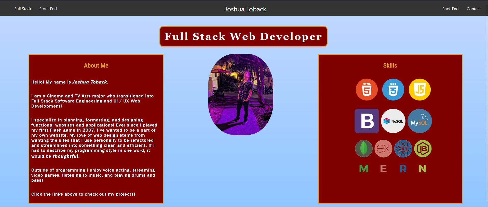
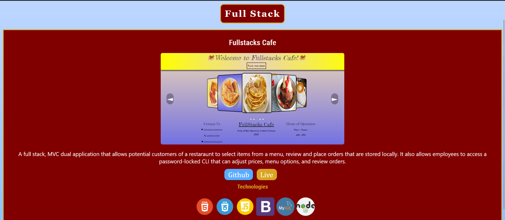
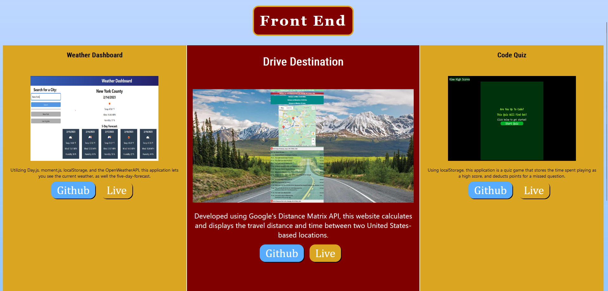
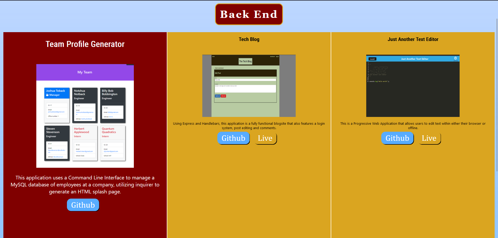
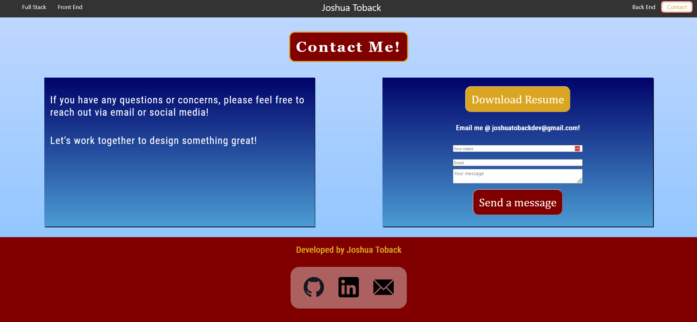

# Joshua Toback

!

## Table of Contents

- [Description](#description)
- [Installation](#installation)
- [Usage](#usage)
- [Licenses](#licenses)
- [Questions](#questions)
- [Credits](#credits)

## Description

As a dveloper, it's essential to constantly learn new tools to make your websites more streamlined and reactive. Hence, the React Portfolio!

In this portfolio, you can browse through various projects, each with different technologies and skillsets used!

## Installation

!

## Usage

Once you see the homepage above, feel free to learn more about me and what skillsets I can offer. After that, click one of the items above to see some of my projects!

This is my Full Stack page, focused on major applications that heavily utilize Front End and Back End technologies!

These are the Front End and Back End pages, which both share a grid that scales up whatever project you're looking at! Each project has a github and live button so you can see the code both in and out of action!

This contact page features a fully optimized contact form and a downloadable resume! 

## Licenses

    This project is covered under the MIT license. To learn more about what this means, click the license button at the top.

## Questions

Have questions or concerns? Please reach out to me via email!  
 GitHub: https://github.com/JoshuaToback  
 Email: joshuatobackdev@gmail.com

## Credits

Joshua Toback
